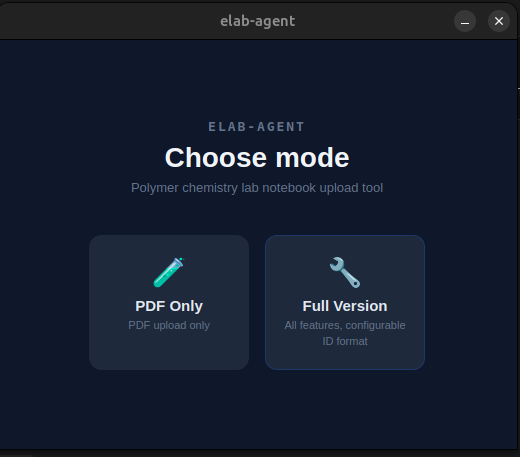
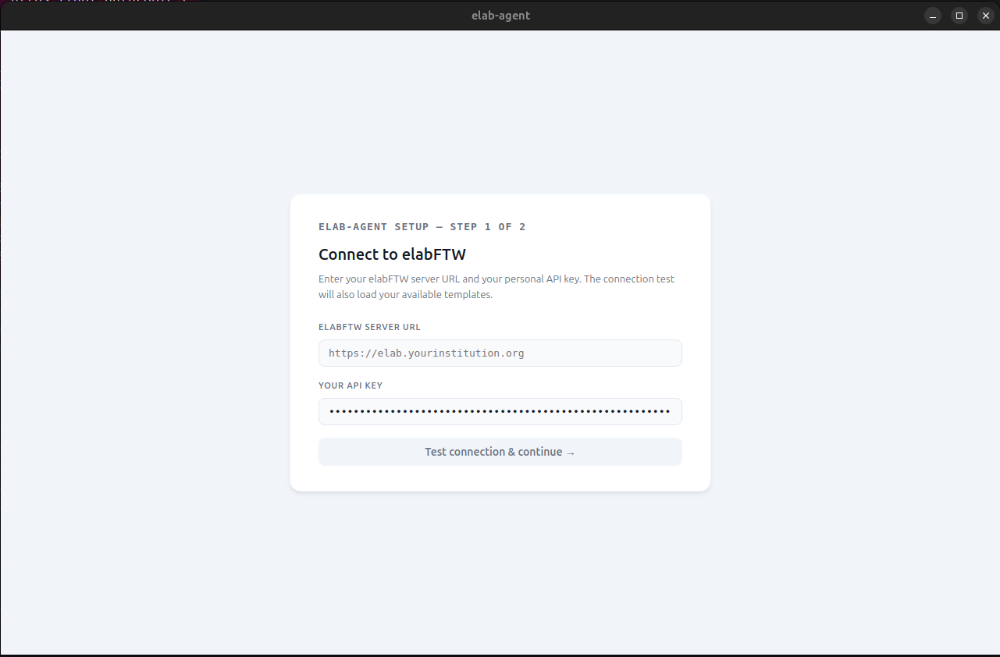
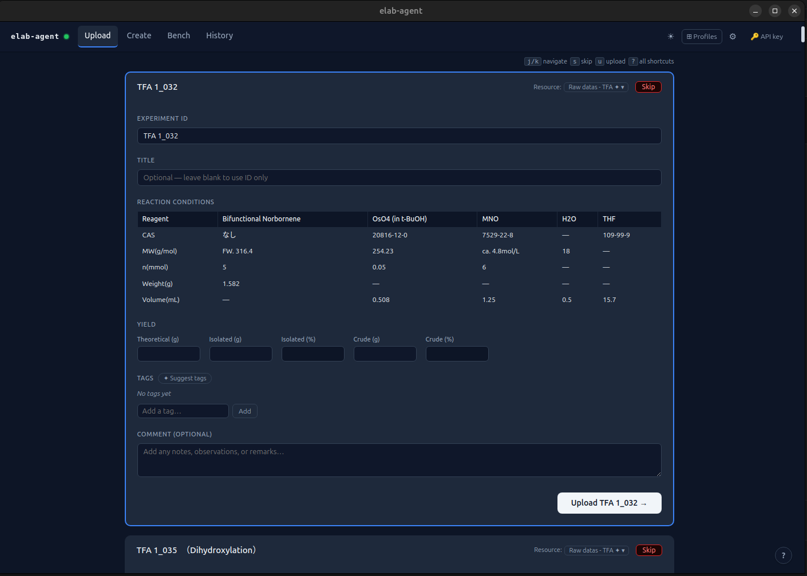
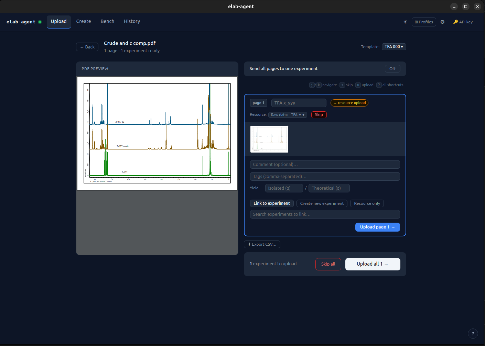
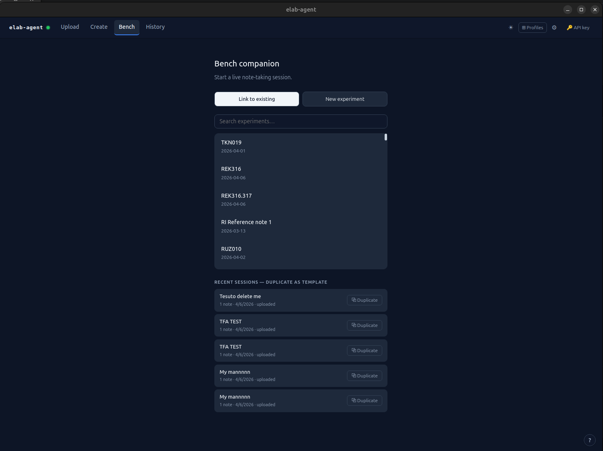

# elab-agent

A desktop companion for [elabFTW](https://www.elabftw.net/) — upload experiment data, manage entries, and capture live bench notes from your phone, all without touching the elabFTW web interface.

---

## What it does

**elab-agent** sits between your raw experiment files and your elabFTW electronic lab notebook. Drop a Word document, a PDF, or a batch of images; the app parses them, detects experiment IDs, shows you a preview, and uploads everything to the right elabFTW entries in the correct order.

It comes in two flavours:

| Edition | What you get |
|---------|-------------|
| **Full Version** | Word (.docx), PDF, images, live bench companion, AI tag suggestions |
| **PDF Only** | PDF upload only — lighter install for community labs |

---

## Download

Go to the [**Releases**](../../releases) page and grab the file for your platform:

| Platform | File | Notes |
|----------|------|-------|
| Windows | `elab-agent-x.y.z-x64-setup.exe` | Installer with wizard |
| macOS (Apple Silicon) | `elab-agent-x.y.z-arm64.pkg` | M1/M2/M3 Macs |
| macOS (Intel) | `elab-agent-x.y.z-x64.pkg` | Older Intel Macs |
| macOS (disk image) | `elab-agent-x.y.z-arm64.dmg` / `*-x64.dmg` | Drag to Applications |
| Linux | `elab-agent-x.y.z-x64.AppImage` | Make executable, run |
| Linux | `elab-agent-x.y.z-x64.deb` | run dpkg to install |

---

## Installation

### Windows

1. Download `*-setup.exe` and double-click it.
2. The installer will show a progress bar — click **Install**, wait, then **Finish**.
3. Find **elab-agent** in your Start Menu or on your Desktop.

### macOS

Working with the `.pkg` installation:

1. Download the `.pkg` for your chip (arm64 = Apple Silicon, x64 = Intel).
2. Double-click → click through the 3-step installer.
3. Open **elab-agent** from your Applications folder.

> If macOS says the app is from an unidentified developer: 
>right-click the file → **Open** → **Open** again in the dialog. 
>
>If macOS says "Apple could not verify "elab-agent-*.pkg":
>Click **Done** → Open **System Settings** → Go to **Privacy & Security** → Go down to **Security** → Click to **Open Anyway** ("elab-agent-*.pkg was blocked to protect your Mac")

Working with the `.dmg` installation:

 1. Mount the image
 2. Drag and place the elab-agent into the /Application folder
 3. Find **elab-agent** in your Start Menu or on your Desktop.

>If macOS says "App is damaged and can't be opened" error: 
>
>run xattr -cr /Applications/elab-agent 

### Linux (AppImage)

```bash
chmod +x elab-agent-*.AppImage
./elab-agent-*.AppImage
```

### Linux (.deb)

```bash
sudo dpkg -i elab-agent-*.deb
# then launch from your application menu or:
elab-agent
```

---

## First launch — mode selection

When you first open elab-agent you will see the launcher:

- **PDF Only** — starts the app in community mode (PDF uploads only). Good for labs with a shared install.
- **Full Version** — starts with all features. Can be PIN-protected so only authorised users access it.



---

## Setup wizard

The first time you pick a mode, a setup wizard walks you through four steps:

1. **Server** — enter your elabFTW server URL and probe it to confirm it is reachable.
2. **Template & resource** — pick the experiment template and resource category to use.
3. **ID pattern** — define the experiment ID format for your lab (e.g. `TFA x_yyy` → matches `TFA 1_001`).
4. **Markers** *(optional)* — set start/end keywords used to group pages in PDF notebooks.

Your settings are saved locally. You can reconfigure at any time via **Settings → Reconfigure**.



---

## Uploading files

### Word (.docx) — Full Version only

Drop a Word document onto the upload zone. elab-agent splits it into pages at section breaks, detects the experiment ID on each page, and extracts ChemDraw schematics automatically.

You get a page-by-page preview with:
- Detected ID (editable if wrong)
- Skip toggle to exclude pages you don't want to upload
- Duplicate warning if the ID already exists in elabFTW
- AI tag suggestions (if an Anthropic API key is configured)

Click **Upload all** or use keyboard shortcut `Ctrl+Enter` to upload everything at once.



### PDF

Drop a PDF. Each page is rendered as an image, experiment IDs are detected, and pages are grouped into entries. Multi-page groups are stitched into a single inline image.

- **Split / Merge** — combine or split page groups with one click.
- **Drag to reorder** — drag cards to change the upload order.
- **Per-card upload** — upload individual entries without uploading the entire batch.



### Images

Drop one or more images (JPG, PNG, TIFF, WEBP, HEIC). Each image is matched to an experiment entry. Images go to the resource entry, not the experiment body.

### Batch uploads

Drop multiple files at once. A file queue appears at the top — navigate with arrow buttons or click the dropdown. Each file is processed independently.

---

## Keyboard shortcuts

| Key | Action |
|-----|--------|
| `j` / `k` | Next / previous entry |
| `s` | Skip current entry |
| `u` | Upload current entry |
| `Ctrl+Enter` | Upload all entries |
| `?` | Toggle this help |

---

## Bench companion — Full Version only

The bench companion lets you capture live notes, photos, and videos from your phone during an experiment, then upload everything to elabFTW in one step at the end.

### Starting a session

1. On the desktop app, go to **Bench** and start a new session (give it an ID and a title).
2. On your phone, open a browser and navigate to the URL shown on the screen (e.g. `http://192.168.1.x:3000/bench`). No app install needed.
3. Add steps as you go. Notes and photos are autosaved every 30 seconds.



### Features

- **Step timer** — each step shows a live elapsed time stopwatch.
- **Photos & videos** — captured inline; iOS HEIC images are converted automatically.
- **Offline mode** — if the network drops, an amber banner appears and notes are buffered until the connection is restored.
- **Session duplication** — copy the step structure from a previous session to start a new one faster.
- **Upload** — when the experiment is done, tap **Upload to elabFTW** from the desktop app.

---

## Upload history

The **History** tab keeps a log of everything uploaded this session:

- **Uploads** — files sent to elabFTW with status (success / failed).
- **Created** — entries created via the manual creation tool.
- **Deleted** — entries deleted via the bulk delete tool.
- **Bench** — bench sessions uploaded.

Failed uploads show a **↺ Retry** button that takes you back to the upload page with a hint about which file to drop again.

You can also **Export CSV** from either the Word or PDF review panel — choose "All entries" or "Uploaded only".

---

## Multi-server profiles

If you work with more than one elabFTW server, use **Profiles** in the top navigation bar:

1. Connect to a server and enter your API key normally.
2. In the nav bar, click **Profiles** → type a name → **Save**.
3. Switch between profiles with one click — no re-entering API keys.

API keys are stored only in your browser's local storage and never sent to any server.

---

## Managing experiments

The **Create / Delete** tab lets you:

- **Create** a new blank experiment entry manually (useful for setting up before a bench session).
- **Bulk delete** — search your experiments, tick checkboxes, and delete several at once.

---

## Template selection

Each upload session can use a different elabFTW template. Click the **Template** dropdown in the review panel header to switch. Click the **👁** (eye) button next to a template to preview its content before selecting it.

---

## Dark mode

Click the **☾** button in the top-right corner of the nav bar to toggle dark mode. Your preference is saved.

---

## Advanced — AI tag suggestions

If you have an [Anthropic](https://www.anthropic.com/) API key, elab-agent can suggest tags for each experiment entry. Enter the key in the setup wizard (Step 4) or via **Settings**. Tag suggestions appear inline in the review panel and can be accepted or dismissed.

---

## Troubleshooting

### "elabFTW is not reachable"
- Check that your server URL is correct (include `https://`).
- Make sure your API key has not expired.
- If you are on a VPN, confirm it is connected.

### ChemDraw schematics are missing
- EMF→PNG conversion requires LibreOffice or ImageMagick to be available. On the desktop app, these are bundled automatically.

### The app opens but shows a blank screen
- On Linux, try running with `--no-sandbox` if using the `.deb` package.
- Check the **Logs** button on the landing page for backend error messages.

### Full Version PIN forgotten
- The PIN is stored locally on this machine. You can reset it by deleting the `elab-agent-prefs` entry from your OS keychain / Electron user data store.

---

## About

Built for daily use in a polymer chemistry lab.  
Backend: Python (FastAPI + PyInstaller). Frontend: React + Vite. Desktop: Electron.

[elabFTW](https://www.elabftw.net/) is open-source ELN software — this tool is an independent companion, not affiliated with the elabFTW project.
